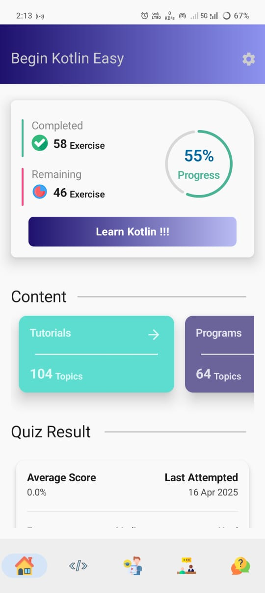
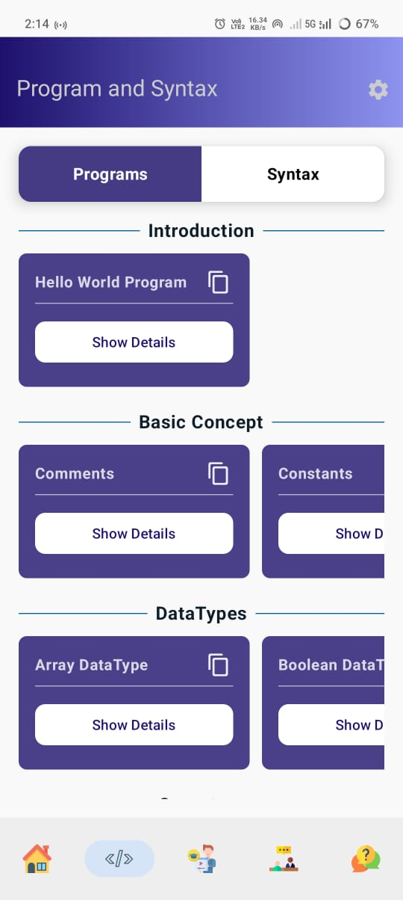
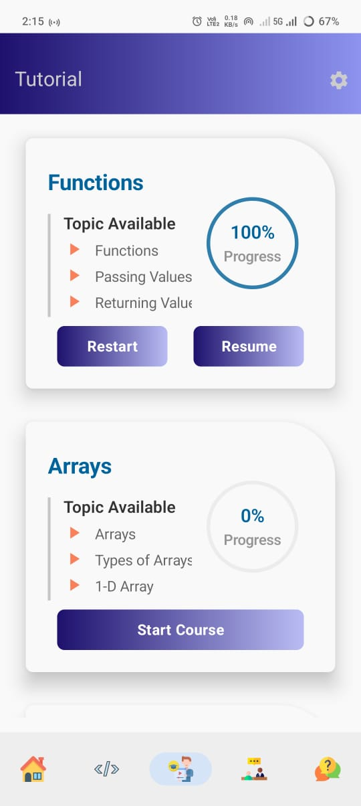
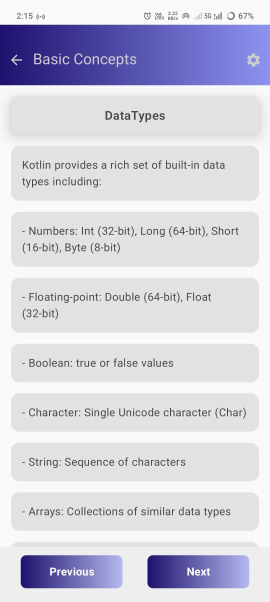
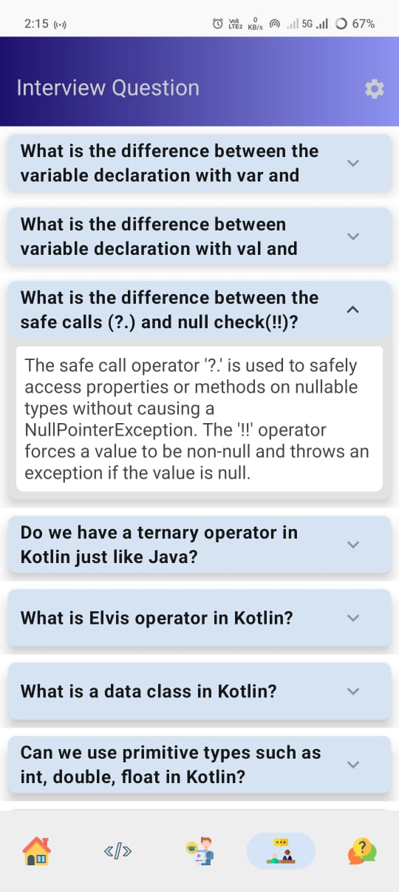
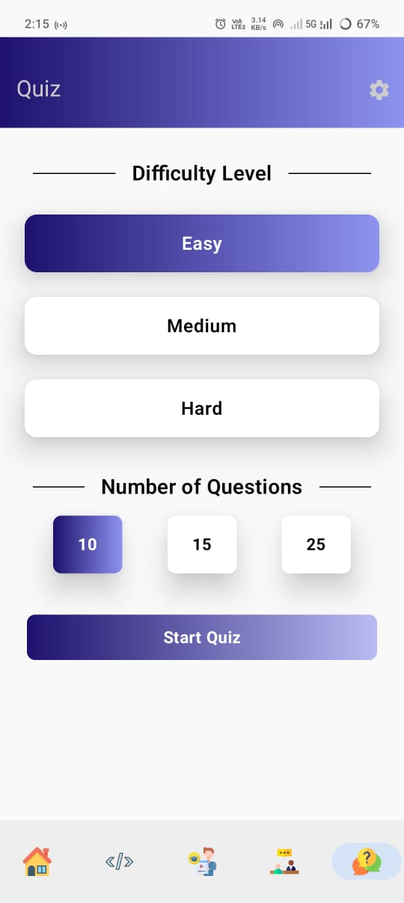
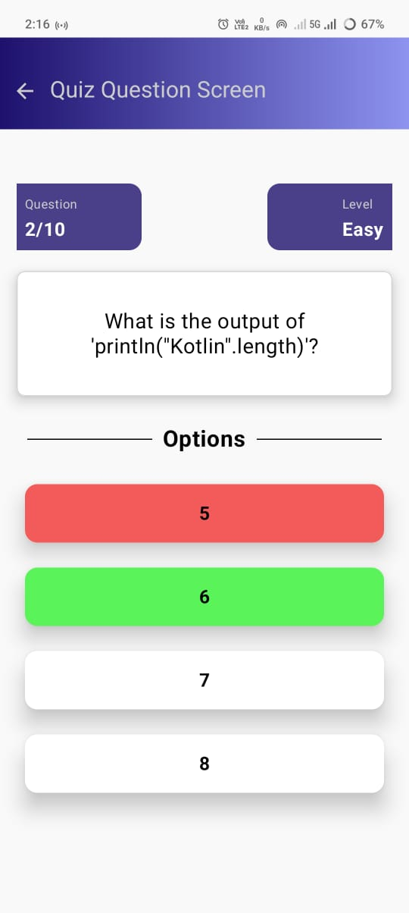
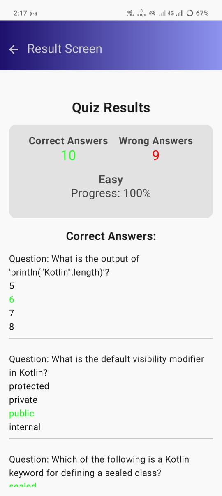

# 📱 Begin Kotlin Easy

**Begin Kotlin Easy** is a fully functional Android learning app designed for Kotlin beginners. It provides structured content like tutorials, syntax samples, interview Q&A, and quizzes to help users learn and track their progress interactively.

---

## 🚀 Features

- 📘 **Programs & Syntax**: Browse through practical Kotlin code snippets with explanations.
- 📚 **Tutorials**: Learn Kotlin step-by-step through categorized chapters.
- ❓ **Interview Q&A**: Prepare for Kotlin interviews with expandable question cards.
- 🧠 **Quiz**: Select difficulty levels and test your knowledge. Result screen summarizes your performance.
- 📊 **Progress Tracking**: Tracks tutorial completion and quiz scores on the home screen.

---


## 📷 Screenshots
|  |  |
|  |  |
|  |  |
|  |  |

---

## 🛠️ Tech Stack

- **Kotlin**
- **Jetpack Compose** – Modern UI toolkit
- **MVVM Architecture** – For clean separation of logic and UI
- **Room Database** – Local storage for offline content and user progress
- **Retrofit** *(in learning phase)* – Used in separate Weather App
- **DeepSeek** – Assisted with backend setup and integration

---

## 📦 Installation

1. Clone the repository:
   ```bash
   git clone https://github.com/yourusername/BeginKotlinEasy.git

### 📚 Credits / Inspiration

Big thanks to the [Kotlin Tutorial App]([https://play.google.com/store/apps/details?id=com.example.kotlintutorial](https://play.google.com/store/apps/details?id=club.onepercent.kotlin_tutorial&hl=en_IN)) for inspiring the UI layout and design structure.
